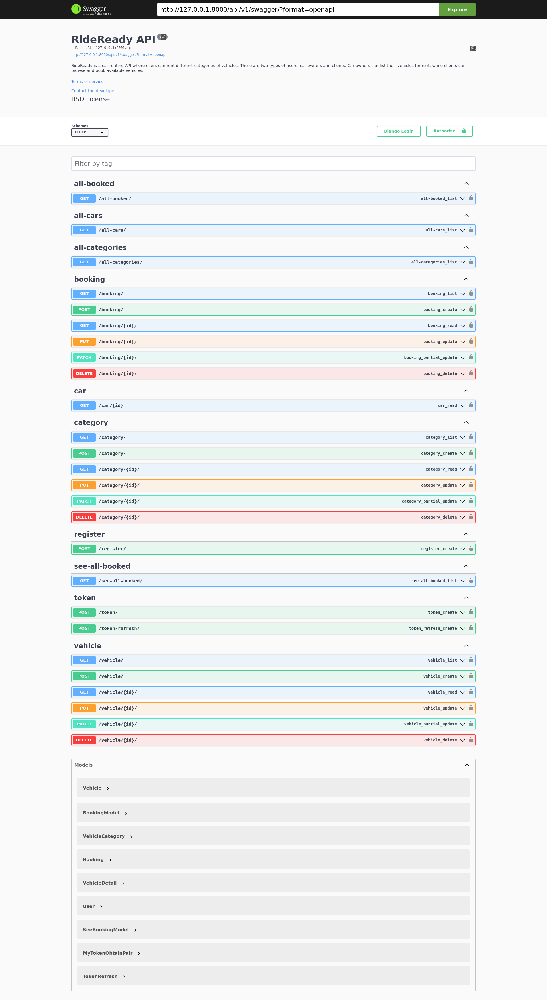
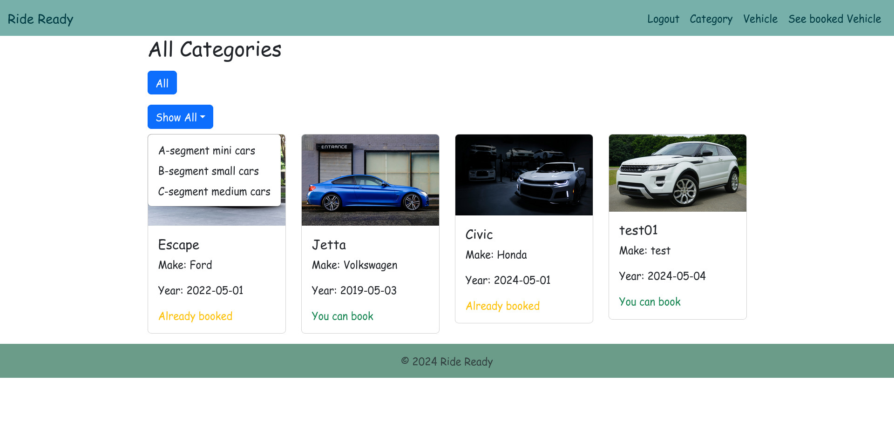
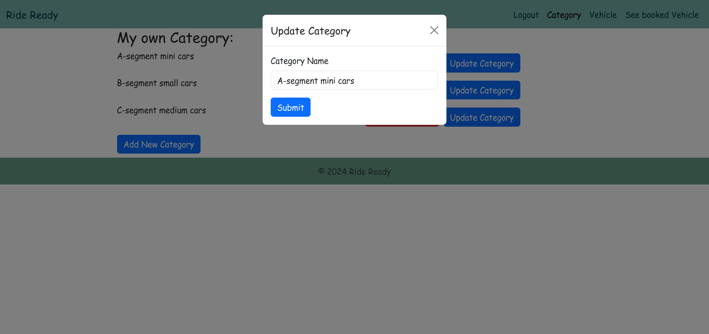
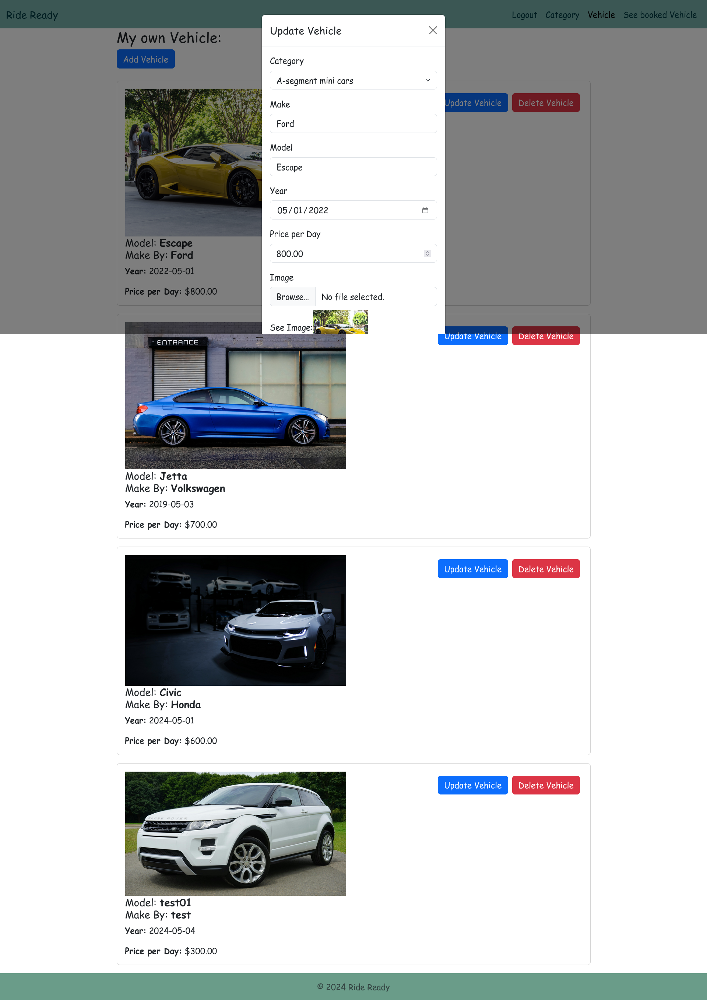
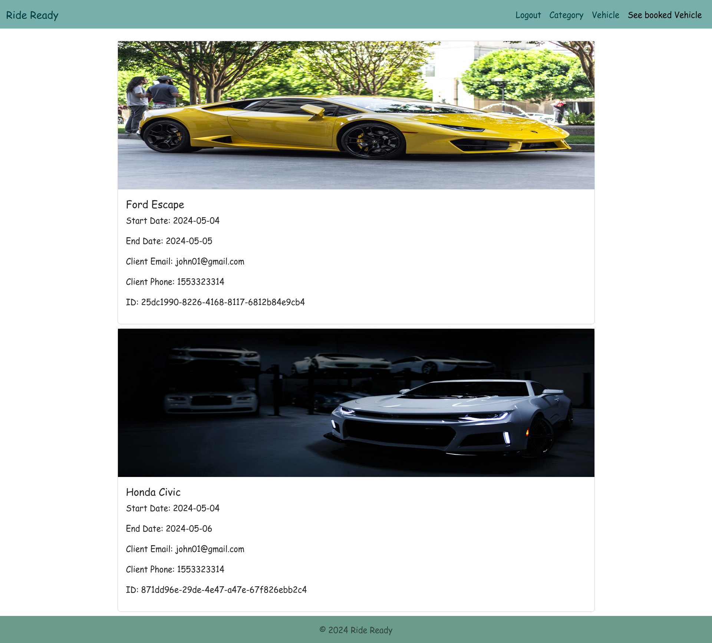
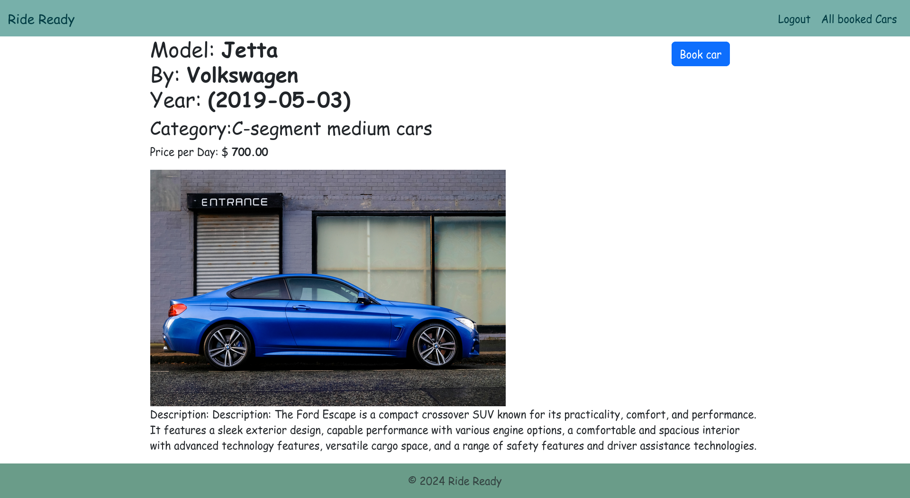
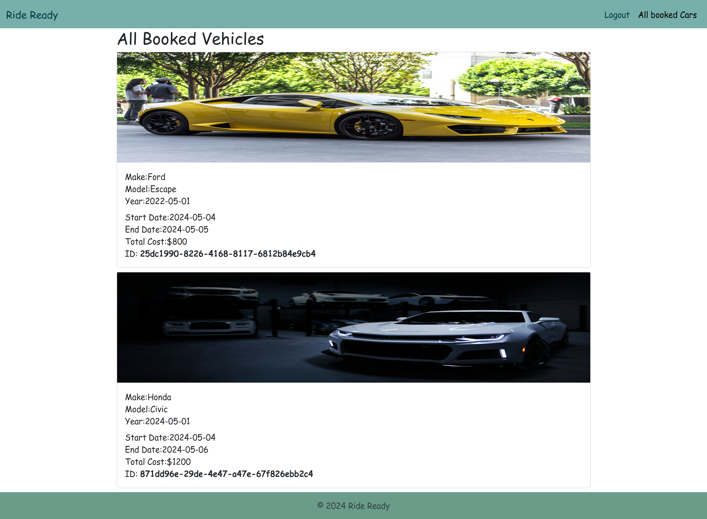

# RideReady

A full-stack vehicle rental platform built with Django (backend) and React (frontend).

## Project Structure

```
ride-ready/
├── frontend/              # React frontend application
│   ├── src/              # React components and logic
│   ├── public/           # Static assets
│   └── package.json      # Frontend dependencies
├── backend/              # Django backend API
│   └── RideReady/        # Django project
│       ├── Account/      # User authentication
│       ├── Vehicle/      # Vehicle management
│       ├── Order/        # Booking/orders
│       └── manage.py     # Django management
├── terraform/            # AWS infrastructure as code
└── .github/workflows/    # CI/CD pipelines
```

## Quick Start

### Frontend
```bash
cd frontend
npm install
npm start
```
See [frontend/README.md](frontend/README.md) for details.

### Backend
```bash
cd backend/RideReady
docker compose up -d
```
See [backend/RideReady/README.md](backend/RideReady/README.md) for details.

## Screenshots

Demo:







